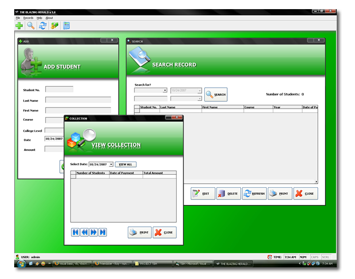



## Simple Payment System

### Description

This is my first program i made in VB 6.0. This simple program is for the beginners in VB like me. This system can add, edit, delete, output reports and etc. Please vote this little system. Thank you and God Bless...

The above screen shot I used third party button but this I changed the buttons into a basic because server from this site deleted the file for the third party when i uploaded this program. But the environment is the same except the buttons.

-Roy Villafuerte Naparan
 
### More Info
 

             |
---                |---
**Submitted On**   |2007-10-24 19:05:26
**By**             |[Roy Naparan](https://github.com/Planet-Source-Code/PSCIndex/blob/master/ByAuthor/roy-naparan.md)
**Level**          |Beginner
**User Rating**    |4.2 (21 globes from 5 users)
**Compatibility**  |VB 4\.0 \(16\-bit\), VB 4\.0 \(32\-bit\), VB 5\.0, VB 6\.0, VBA MS Access
**Category**       |[Databases/ Data Access/ DAO/ ADO](https://github.com/Planet-Source-Code/PSCIndex/blob/master/ByCategory/databases-data-access-dao-ado__1-6.md)
**World**          |[Visual Basic](https://github.com/Planet-Source-Code/PSCIndex/blob/master/ByWorld/visual-basic.md)
**Archive File**   |[Simple\_Pay20883810242007\.zip](https://github.com/Planet-Source-Code/roy-naparan-simple-payment-system__1-69548/archive/master.zip)

